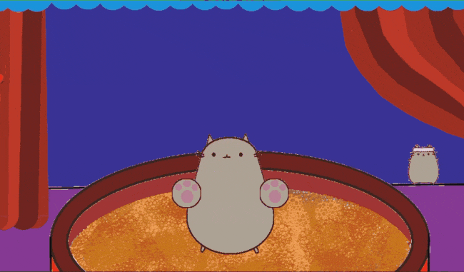
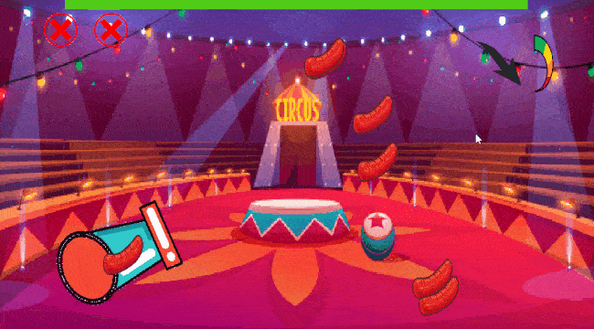
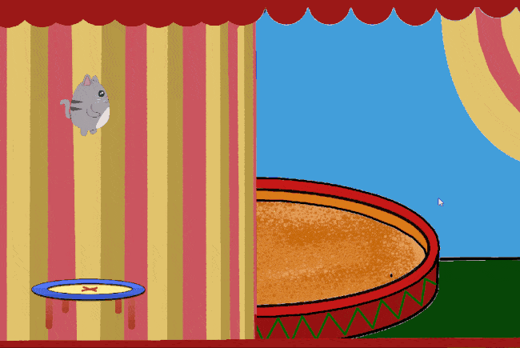
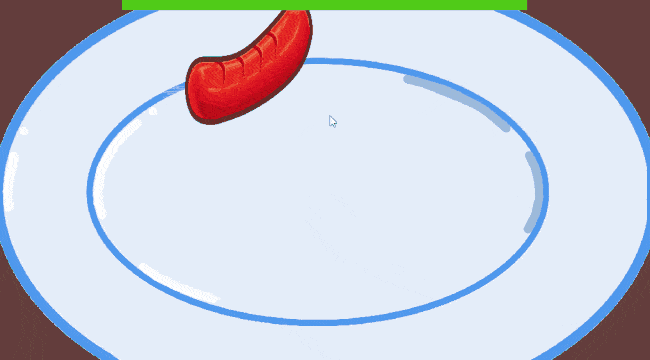

# Cat Circus Game
## BSU FAMCS 2020
### A game developed by a group of BSU students as an educational project in C++ and Qt.

This repository contains a mini-game about cats doing tricks in the circus. 
It's implemented in pure C++ using Qt framework.
It was the first team project of its members and all code, ideas and especially graphics and animations were done "by their own hands". So don't judge it too seriously :)

### What's inside?

Here is a game putting player into a loop of mini-games: the further you get, the harder mini-games become. Each mini-game gives you a [difficulty bonus] + 100 points if you win.
Your goal is pretty simple: **score as much as you can**.
Although these minigames are rather simple, increasing tempo and difficulty can give you a bit of drive :)

You can juggle, jump on a trampoline, shoot cats from a canon and have some fun :)

|  |  |
| --- | ---- |
|   |   |

### Contributors

* Vladimir Kuzmitski [@VKuzia](https://github.com/VKuzia)
* Artyom Stasiukevich [@artiomstasiukevich](https://github.com/artiomstasiukevich)
* Anton Suravezhkin [@AnotherHubUser](https://github.com/AnotherHubUser)
* Maria Burykina [@MariaEmid](https://github.com/MariaEmid)

### Thanks to

* Fedor Filipovich
* Alexey Bakevich

for support and code review.

